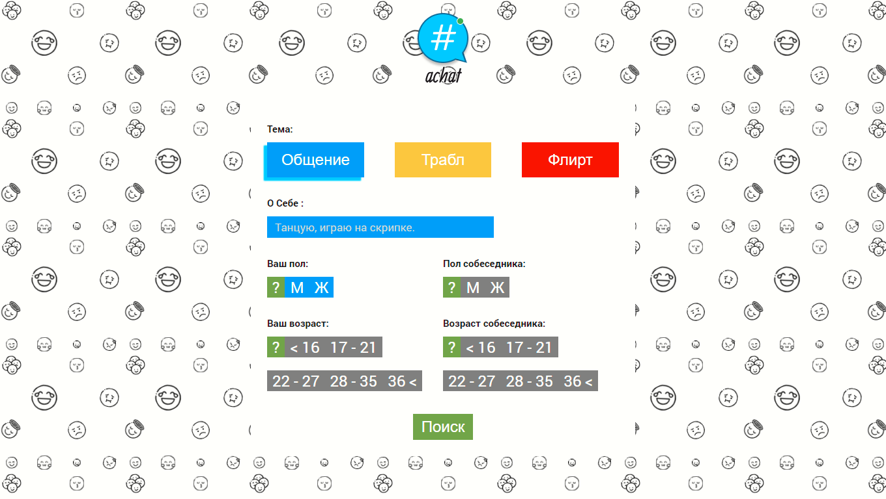
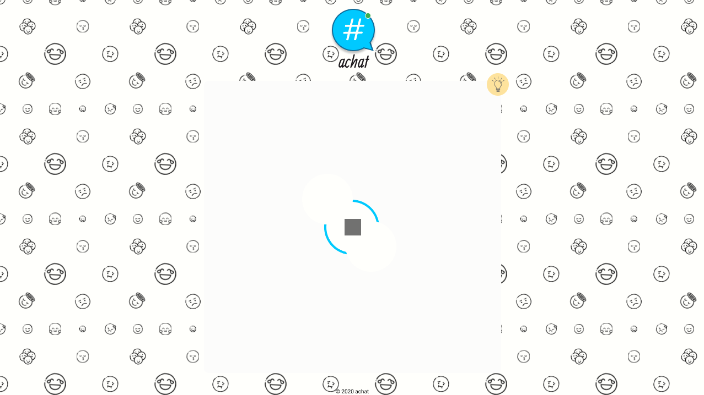
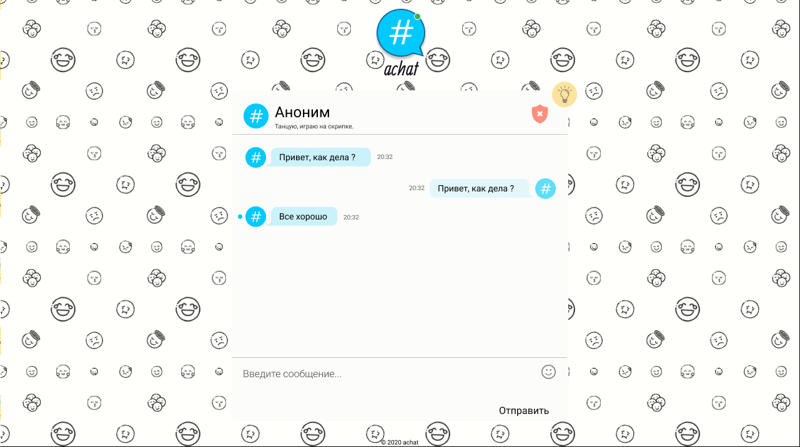

# AChat
>This application is created to communicate with anonymous

## Table of contents
* [General info](#general-info)
* [Screenshots](#screenshots)
* [Technologies](#technologies)
* [Setup](#setup)
* [Features](#features)
* [Status](#status)
* [Inspiration](#inspiration)
* [Contact](#contact)

## General info
 Anonymous chat divided into several categories with the ability to search by gender and age. 

## Screenshots




## Technologies
* MERN
* SocketIO 


## Setup
``` node
$npm install
```

### Client 
``` node
$npm start
```

### Server
``` node
$npm run dev
```


## Features
List of features TODOs for future development
* 2 versions of the web-site
* proposal form 
* save chat 


## Status
Project is: _in progress_

Everything is going slowly because only I am involved in the development.


## Inspiration
Project inspired by [nekto.me](http://nekto.me/).

## Contact
Created by [@filicaliva](https://www.linkedin.com/in/vfilimonchuk/) - feel free to contact me!